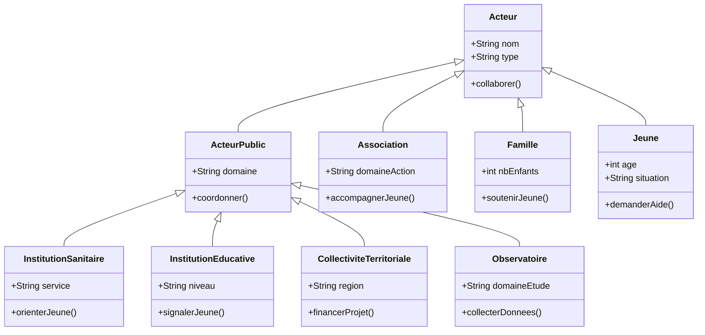

```mermaid
classDiagram
class Acteur {
  +String nom
  +String type
  +collaborer()
}

class ActeurPublic {
  +String domaine
  +coordonner()
}

class Association {
  +String domaineAction
  +accompagnerJeune()
}

class Famille {
  +int nbEnfants
  +soutenirJeune()
}

class Jeune {
  +int age
  +String situation
  +demanderAide()
}

class InstitutionSanitaire {
  +String service
  +orienterJeune()
}

class InstitutionEducative {
  +String niveau
  +signalerJeune()
}

class CollectiviteTerritoriale {
  +String region
  +financerProjet()
}

class Observatoire {
  +String domaineEtude
  +collecterDonnees()
}

%% --- Héritages ---
Acteur <|-- ActeurPublic
Acteur <|-- Association
Acteur <|-- Famille
Acteur <|-- Jeune

ActeurPublic <|-- InstitutionSanitaire
ActeurPublic <|-- InstitutionEducative
ActeurPublic <|-- CollectiviteTerritoriale
ActeurPublic <|-- Observatoire

```
