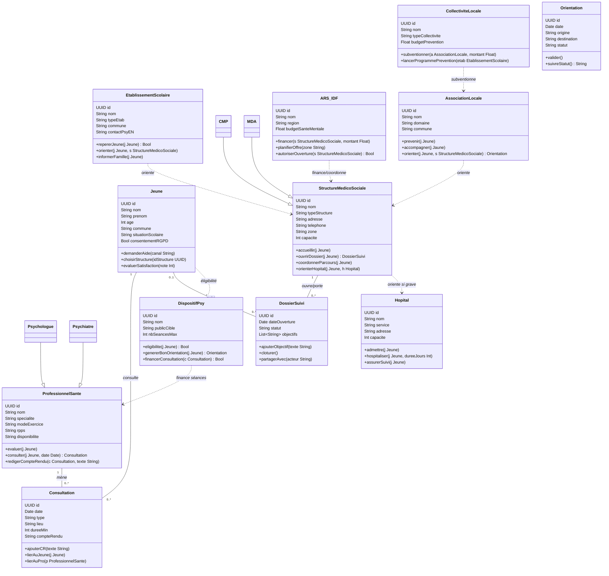

```mermaid
classDiagram
direction TB

class Jeune {
  UUID id
  String nom
  String prenom
  Int age
  String commune
  String situationScolaire
  Bool consentementRGPD
  +demanderAide(canal String)
  +choisirStructure(idStructure UUID)
  +evaluerSatisfaction(note Int)
}

class EtablissementScolaire {
  UUID id
  String nom
  String typeEtab
  String commune
  String contactPsyEN
  +repererJeune(j Jeune) Bool
  +orienter(j Jeune, s StructureMedicoSociale)
  +informerFamille(j Jeune)
}

class ProfessionnelSante {
  UUID id
  String nom
  String specialite
  String modeExercice
  String rpps
  String disponibilite
  +evaluer(j Jeune)
  +consulter(j Jeune, date Date) Consultation
  +redigerCompteRendu(c Consultation, texte String)
}

class Psychologue
class Psychiatre
Psychologue --|> ProfessionnelSante
Psychiatre --|> ProfessionnelSante

class StructureMedicoSociale {
  UUID id
  String nom
  String typeStructure
  String adresse
  String telephone
  String zone
  Int capacite
  +accueillir(j Jeune)
  +ouvrirDossier(j Jeune) DossierSuivi
  +coordonnerParcours(j Jeune)
  +orienterHopital(j Jeune, h Hopital)
}

class CMP
class MDA
CMP --|> StructureMedicoSociale
MDA --|> StructureMedicoSociale

class Hopital {
  UUID id
  String nom
  String service
  String adresse
  Int capacite
  +admettre(j Jeune)
  +hospitaliser(j Jeune, dureeJours Int)
  +assurerSuivi(j Jeune)
}

class DispositifPsy {
  UUID id
  String nom
  String publicCible
  Int nbSeancesMax
  +eligibilite(j Jeune) Bool
  +genererBonOrientation(j Jeune) Orientation
  +financerConsultation(c Consultation) Bool
}

class ARS_IDF {
  UUID id
  String nom
  String region
  Float budgetSanteMentale
  +financer(s StructureMedicoSociale, montant Float)
  +planifierOffre(zone String)
  +autoriserOuverture(s StructureMedicoSociale) Bool
}

class CollectiviteLocale {
  UUID id
  String nom
  String typeCollectivite
  Float budgetPrevention
  +subventionner(a AssociationLocale, montant Float)
  +lancerProgrammePrevention(etab EtablissementScolaire)
}

class AssociationLocale {
  UUID id
  String nom
  String domaine
  String commune
  +prevenir(j Jeune)
  +accompagner(j Jaune)
  +orienter(j Jeune, s StructureMedicoSociale) Orientation
}

class DossierSuivi {
  UUID id
  Date dateOuverture
  String statut
  List~String~ objectifs
  +ajouterObjectif(texte String)
  +cloturer()
  +partagerAvec(acteur String)
}

class Consultation {
  UUID id
  Date date
  String type
  String lieu
  Int dureeMin
  String compteRendu
  +ajouterCR(texte String)
  +lierAuJeune(j Jeune)
  +lierAuPro(p ProfessionnelSante)
}

class Orientation {
  UUID id
  Date date
  String origine
  String destination
  String statut
  +valider()
  +suivreStatut() String
}

%% Relations principales (rôles/fonctions)
Jeune "1" -- "0..*" Consultation : *consulte*
ProfessionnelSante "1" -- "0..*" Consultation : *mène*
Jeune "0..1" -- "0..*" DossierSuivi : *suivi*
StructureMedicoSociale "1" -- "0..*" DossierSuivi : *ouvre/porte*
EtablissementScolaire ..> StructureMedicoSociale : *oriente*
AssociationLocale ..> StructureMedicoSociale : *oriente*
StructureMedicoSociale ..> Hopital : *oriente si grave*
DispositifPsy ..> ProfessionnelSante : *finance séances*
ARS_IDF ..> StructureMedicoSociale : *finance/coordonne*
CollectiviteLocale ..> AssociationLocale : *subventionne*
Jeune ..> DispositifPsy : *éligibilité*
```
