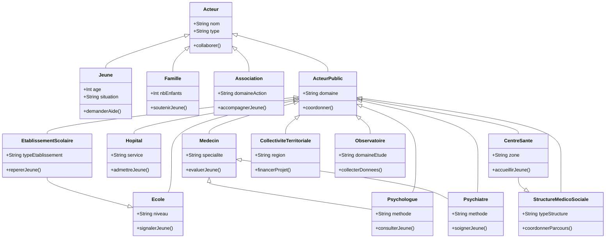

```mermaid
classDiagram
direction TB


%% CLASSE DE BASE
class Acteur {
  +String nom
  +String type
  +collaborer()
}

%% ACTEURS SOCIAUX
class Jeune {
  +Int age
  +String situation
  +demanderAide()
}

class Famille {
  +Int nbEnfants
  +soutenirJeune()
}

class Association {
  +String domaineAction
  +accompagnerJeune()
}


%% ACTEURS PUBLICS
class ActeurPublic {
  +String domaine
  +coordonner()
}


%% SECTEUR ÉDUCATIF
class Ecole {
  +String niveau
  +signalerJeune()
}

class EtablissementScolaire {
  +String typeEtablissement
  +repererJeune()
}
EtablissementScolaire --|> Ecole


%% SECTEUR SANTÉ
class Hopital {
  +String service
  +admettreJeune()
}

class Medecin {
  +String specialite
  +evaluerJeune()
}

class Psychologue {
  +String methode
  +consulterJeune()
}

class Psychiatre {
  +String methode
  +soignerJeune()
}

Medecin <|-- Psychologue
Medecin <|-- Psychiatre


%% STRUCTURES DE SUIVI ET DE COORDINATION
class StructureMedicoSociale {
  +String typeStructure
  +coordonnerParcours()
}

class CentreSante {
  +String zone
  +accueillirJeune()
}
CentreSante --|> StructureMedicoSociale


%% AUTRES ACTEURS INSTITUTIONNELS
class CollectiviteTerritoriale {
  +String region
  +financerProjet()
}

class Observatoire {
  +String domaineEtude
  +collecterDonnees()
}


%% HÉRITAGES PRINCIPAUX
Acteur <|-- Jeune
Acteur <|-- Famille
Acteur <|-- Association
Acteur <|-- ActeurPublic

ActeurPublic <|-- Ecole
ActeurPublic <|-- EtablissementScolaire
ActeurPublic <|-- Hopital
ActeurPublic <|-- Medecin
ActeurPublic <|-- Psychologue
ActeurPublic <|-- Psychiatre
ActeurPublic <|-- StructureMedicoSociale
ActeurPublic <|-- CentreSante
ActeurPublic <|-- CollectiviteTerritoriale
ActeurPublic <|-- Observatoire


```
