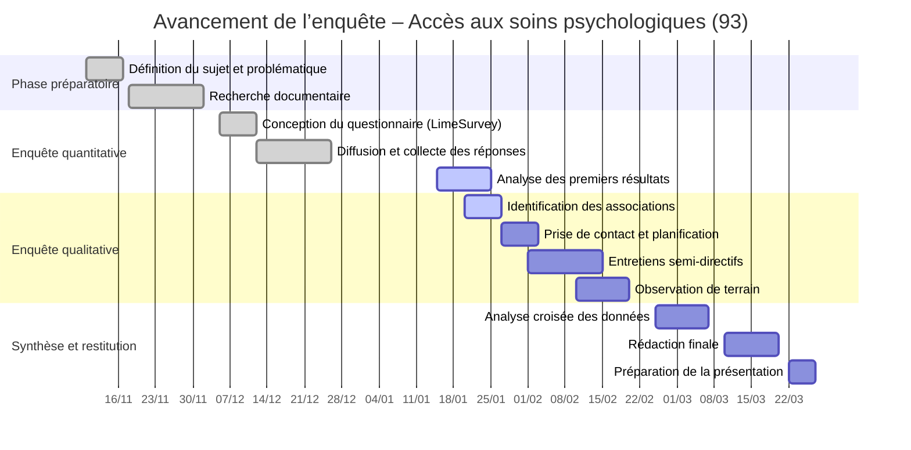

# État d’avancement de l’enquête  
## Accès aux soins psychologiques pour les jeunes en Seine-Saint-Denis

Ce document présente l’état d’avancement du projet sous forme de diagramme de Gantt.

```mermaid
gantt
    title Avancement de l’enquête – Accès aux soins psychologiques (93)
    dateFormat  YYYY-MM-DD
    axisFormat  %d/%m

    section Phase préparatoire
    Définition du sujet et problématique        :done,    t1, 2025-11-10, 7d
    Recherche documentaire                      :done,    t2, 2025-11-18, 14d

    section Enquête quantitative
    Conception du questionnaire (LimeSurvey)  :done,    t3, 2025-12-05, 7d
    Diffusion et collecte des réponses         :done,    t4, 2025-12-12, 14d
    Analyse des premiers résultats             :active,  t5, 2026-01-15, 10d

    section Enquête qualitative
    Identification des associations            :active,  t6, 2026-01-20, 7d
    Prise de contact et planification           :         t7, after t6, 7d
    Entretiens semi-directifs                   :         t8, 2026-02-01, 14d
    Observation de terrain                     :         t9, 2026-02-10, 10d

    section Synthèse et restitution
    Analyse croisée des données                :         t10, 2026-02-25, 10d
    Rédaction finale                           :         t11, 2026-03-10, 10d
    Préparation de la présentation             :         t12, 2026-03-22, 5d
```
